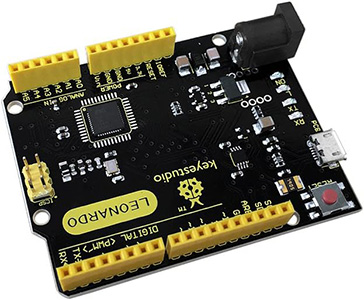
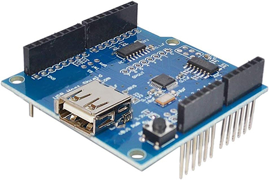
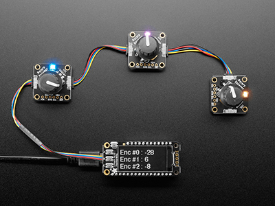
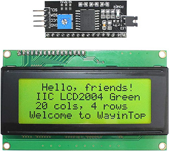
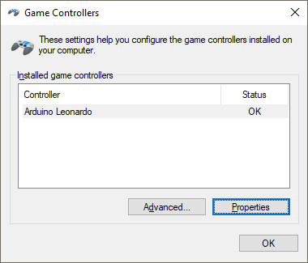
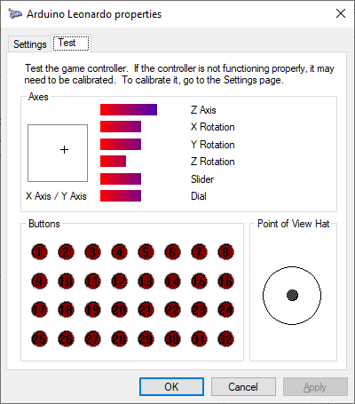
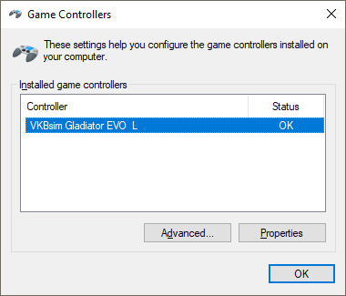

# How to trim properly

If you play any sort of flight sim you're probably familiar with trimming: compensating for pitch, roll, or yaw not by counteracting them with your stick or yoke, but by turning some knobs that add some elevator, aileron, or rudder offset to the plane's control surfaces to balance the forces acting on the plane.

You're probably also familiar with the fact that in-game trim settings can be a hot mess. Take Microsoft Flight Simulator 2020/2024: there are three axes that need trim, but does not offer axis bindings for all three. Good luck!

So let's make a trim box that literally offsets our elevator, aileron, and rudder values instead. Directly, by hijacking the USB data signals for those things. It's time to Arduino!

## The idea

USB devices are just digital signal boxes, so it should be entirely possible to make something that sits between our stick/yoke and the computer, reading every signal that it sees from the stick/yoke and passing those values on, _except_ when it sees values associated with the pitch, roll, and yaw axes. For those, we want it to first add or subtract a trim offset, and _then_ pass the value on.



So we'll need something that we can plug between the stick/yoke and computer: an Arduino Leonardo with a USB host shield will work fine for that.

And we'll need some code that makes that arduino register as "our stick/yoke" and then pass any and all USB signals through. For which there are libraries that we can simply load into an Arduino sketch.

We'll also need some way to _set_ our trim offsets, so let's get a little fancy and use 2 rotary encoders per axis, so we can perform coarse and fine offset manipulation, for six rotary encoders each.

And finally we'll probably want something that lets us see what trim values are current active, so we'll want some sort of display, too.

## Components

So, the list of components I'll be using - you can of course use different ones, but then you'll probably also have to change the code to work with those (which might be super easy, or rather a lot of work depending on how similar/compatible your choices are).

### The Arduino



Since we're going to play the USB pass-through game, we need an Arduino that can act as a USB device. If you're familiar with Arduinos you'll know that you program and communicate with them via a serial COM port, even though you plug them in with a little usb cable: that's a problem. We want to intercept USB signals and then relay those _as USB signals_ so we need an Arduino flavour that has "being a USB device" built in. You have some options, I went with an [Keyestudio "Leonardo"](https://www.amazon.ca/KEYESTUDIO-Leonardo-Development-Board-Arduino/dp/B0786LJQ8K) which uses the ATmega32U4 and has 28kb of program space and 2.5kb of dynamic memory, which isn't a lot, but should be just about enough for what we're going to be doing.

### Making the Arduino act as a USB hub



Second, we'll need something that lets the Arduino pretend to be a USB hub that you can plug other devices into. Thankfully, there are dozens of "USB Host Shield" boards that you can buy that plug directly into the standard Arduino pin headers to add the functionality we need.

I ended up [with this one](https://www.amazon.ca/ARCELI-Shield-Arduino-Support-Android/dp/B07J2KKGZ4) and that was very much purely a "which one is the cheapest" choice.

### Rotary controls



Third through Ninth: we want rotary encoders. These are the infinitely-spinny, clicky rotating knobs. We could use potentiometers, which are the "off to full" knobs with hard stops on both ends, but those are analog components without any sort of precision in terms of how much they're offsetting, so for precision we want digital components: rotary encoders basically generate "left" or "right" signals for every click you move them, with the fancy ones also letting you press the knob as if it's a regular button, which gives us everything we need to increase, decrease, or reset an offset value.

I got these [lovely AdaFruit encoders with RGB leds](https://www.adafruit.com/product/4991), which simply daisy-chain through each other with little stemma cables, and to an Arduino using a stemma breakout cable.

### Seeing what we're doing



Lastly, we'll want a 4x20 character (or even "just pixels") display so we can see what offset values we're actually setting while we're trimming. I ended up getting this [nice and big green LCD display](https://www.amazon.ca/WayinTop-Display-Interface-Adapter-Arduino/dp/B07TXBV8MS) with a little I2C "backpack" so it can just daisy-chain off the I2C rotary encoders.

## Setting up the code

Before we can flash our Arduino to be a trim box, we need to gather some information on the device it's going to pretend to be.

### Getting the device information

First, load up the `joystick-dump` sketch in the IDE, and then flash your Arduino-with-USB-host-shield with that. Don't close the IDE, instead turn on the serial monitor and set the baud rate to 115200, then reset your Arduino. The serial monitor should show you something like this:

```text
# ready - plug in a joystick
```

Doing what it asks should then dump the stick/yoke's registration information and then prompt you for which axes to use as pitch axis:

```text
idVendor      0x231D
idProduct     0x0201
bcdDevice     0x2122
iManufacturer VKB-Sim ⸮ Alex Oz 2021
iProduct       VKBsim Gladiator EVO  L
iSerialNumber (none)

# move the pitch control through its full travel, then let go...
```

Run through all three axes, and it'll report which axis IDs it detected, then spit out the code you'll need to update. For me, that means I got this:

```text
# move the pitch control through its full travel, then let go...
  pitch is at offset 3, 219 changes

# move the aileron control through its full travel, then let go...
  aileron is at offset 1, 199 changes

# move the rudder control through its full travel, then let go...
  rudder is at offset 5, 137 changes
```

Followed by my-joystick-specific instructions on what code to update:

```text
// ---- stick-trim-box/joystick-profile.ino: replace the array ----

static const uint8_t JoystickReportDescriptor[] PROGMEM = {
  0x05,0x01,0x09,0x04,0xA1,0x01,0x05,0x01,0x85,0x01,0x05,0x01,0x09,0x30,0x75,0x10,
  0x95,0x01,0x15,0x00,0x26,0xFF,0x0F,0x46,0xFF,0x0F,0x81,0x02,0x05,0x01,0x09,0x31,
  0x75,0x10,0x95,0x01,0x15,0x00,0x26,0xFF,0x0F,0x46,0xFF,0x0F,0x81,0x02,0x05,0x01,
  0x09,0x35,0x75,0x10,0x95,0x01,0x15,0x00,0x26,0xFF,0x07,0x46,0xFF,0x07,0x81,0x02,
  0x05,0x01,0x09,0x32,0x75,0x10,0x95,0x01,0x15,0x00,0x26,0xFF,0x07,0x46,0xFF,0x07,
  0x81,0x02,0x05,0x01,0x09,0x33,0x75,0x10,0x95,0x01,0x15,0x00,0x26,0xFF,0x03,0x46,
  0xFF,0x03,0x81,0x02,0x05,0x01,0x09,0x34,0x75,0x10,0x95,0x01,0x15,0x00,0x26,0xFF,
  0x03,0x46,0xFF,0x03,0x81,0x02,0x05,0x01,0x09,0x36,0x75,0x10,0x95,0x01,0x15,0x00,
  0x26,0xFF,0x07,0x46,0xFF,0x07,0x81,0x02,0x05,0x01,0x09,0x37,0x75,0x10,0x95,0x01,
  0x15,0x00,0x26,0xFF,0x07,0x46,0xFF,0x07,0x81,0x02,0x05,0x09,0x19,0x01,0x2A,0x80,
  0x00,0x15,0x00,0x25,0x01,0x75,0x01,0x96,0x80,0x00,0x81,0x02,0x05,0x01,0x09,0x39,
  0x15,0x00,0x26,0x07,0x00,0x35,0x00,0x46,0x68,0x01,0x65,0x14,0x55,0x01,0x75,0x04,
  0x95,0x01,0x81,0x42,0x09,0x00,0x65,0x00,0x55,0x00,0x75,0x04,0x95,0x03,0x81,0x01,
  0x05,0x01,0x09,0x00,0x75,0x10,0x95,0x01,0x81,0x01,0x05,0x01,0x09,0x00,0x75,0x10,
  0x95,0x01,0x81,0x01,0x05,0x01,0x09,0x00,0x75,0x10,0x95,0x01,0x81,0x01,0x05,0x01,
  0x09,0x00,0x75,0x08,0x95,0x17,0x81,0x01,0x85,0x0B,0x05,0x01,0x09,0x00,0x75,0x08,
  0x95,0x3F,0x81,0x01,0x85,0x0C,0x05,0x01,0x09,0x00,0x75,0x08,0x95,0x3F,0x81,0x01,
  0x85,0x08,0x05,0x01,0x09,0x00,0x75,0x08,0x95,0x3F,0x81,0x01,0x15,0x00,0x26,0xFF,
  0x00,0x46,0xFF,0x00,0x85,0x58,0x75,0x08,0x95,0x3F,0x09,0x00,0x91,0x02,0x85,0x59,
  0x75,0x08,0x95,0x80,0x09,0x00,0xB1,0x02,0xC0,
};

// ---- stick-trim-box/usb-host.ino: replace these lines ----

#define REPORT_ID  0x01
#define REPORT_LEN 64
#define OFF_X   1
#define OFF_Y   3
#define OFF_RZ  5

// ---- stick-trim-box/trim-control.ino: replace these lines ----

static const int16_t TRIM_MAX[AXIS_COUNT]    = { 4095, 4095, 2047 };
static const int16_t TRIM_CENTRE[AXIS_COUNT] = { 2047, 2047, 1023 };
```

### Getting our encoder IDs

I don't know how you chained up your rotary encoders, but thankfully I don't have to: we can simple ask the Arduino to perform the same "just let the user twiddle the input and record which ID that is" that we just did for our input axes on the joystick by running the `get-encoder-ids` sketch. Load the sketch, upload it to the arduino and then open the serial monitor at 115200 baud again. This should show you:

```text
found encoder at 0x36
found encoder at 0x37
found encoder at 0x38
found encoder at 0x39
found encoder at 0x3A
found encoder at 0x3B

# turn the coarse pitch encoder
```
Then you just turn each knob in order:

```text
# turn the coarse pitch encoder
  coarse pitch is 0x39
# turn the fine pitch encoder
  fine pitch is 0x36
# turn the coarse aileron encoder
  coarse aileron is 0x37
# turn the fine aileron encoder
  fine aileron is 0x3A
# turn the coarse rudder encoder
  coarse rudder is 0x3B
# turn the fine rudder encoder
  fine rudder is 0x38
```

And once you've input the last one, you're given the code you need to update:

```
// ---- stick-trim-box/trim-control.ino: replace these lines ----

#define ENC_PITCH_COARSE    0x39
#define ENC_AILERON_COARSE  0x37
#define ENC_RUDDER_COARSE   0x3B
#define ENC_PITCH_FINE      0x36
#define ENC_AILERON_FINE    0x3A
#define ENC_RUDDER_FINE     0x38
```

### Making it live

Now that we have all the code updated, upload the `stick-trim-box` code to the Arduino, which should _juuust_ about fit:

```text
Sketch uses 28628 bytes (99%) of program storage space. Maximum is 28672 bytes.
Global variables use 1052 bytes (41%) of dynamic memory, leaving 1508 bytes for local variables. Maximum is 2560 bytes.
```

After uploading, plug in your stick/yoke and reset the Arduino, then fire up `joy.cpl` which is the Windows "Game Controllers" control panel.



 Select your "hijacked" device, and click "properties", which gives you a live readout of all the axes and buttons on your device. Rotating the coarse control knobs should show the "+" and Z-Rotation axes change, and pressing encodes as buttons should reset the offsets.



If so: you're set! Go and enjoy your flight simming with "it just works" trim control, instead of having to mess with controller bindings!

### "Why does it say Arduino Leonardo?"

By default, your joystick will now show up as an Arduino Leonardo because that's literally what it is, but we can change the name and vendor/product ids that it registers with by defining a new board in the `boards.txt` that the Arduino IDE uses.

Find out which one your IDE uses (too many options so I'll leave the rest of the internet to explain how to do that) and then add a new board at the end.

In my case, I added the following to the boards.txt in my user's arduino51/AVR folder:

```ini
##############################################################

gladiator.name=Gladiator NXT Passthrough (Leonardo)

gladiator.vid.0=0x2341
gladiator.pid.0=0x0036
gladiator.vid.1=0x2341
gladiator.pid.1=0x8036
gladiator.vid.2=0x2A03
gladiator.pid.2=0x0036
gladiator.vid.3=0x2A03
gladiator.pid.3=0x8036
gladiator.vid.4=0x231D
gladiator.pid.4=0x0201

gladiator.upload.tool=avrdude
gladiator.upload.protocol=avr109
gladiator.upload.maximum_size=28672
gladiator.upload.maximum_data_size=2560
gladiator.upload.speed=57600
gladiator.upload.disable_flushing=true
gladiator.upload.use_1200bps_touch=true
gladiator.upload.wait_for_upload_port=true

gladiator.bootloader.tool=avrdude
gladiator.bootloader.low_fuses=0xff
gladiator.bootloader.high_fuses=0xd8
gladiator.bootloader.extended_fuses=0xcb
gladiator.bootloader.file=caterina/Caterina-Leonardo.hex
gladiator.bootloader.unlock_bits=0x3F
gladiator.bootloader.lock_bits=0x2F

gladiator.build.mcu=atmega32u4
gladiator.build.f_cpu=16000000L
gladiator.build.vid=0x231D
gladiator.build.pid=0x0201
gladiator.build.usb_manufacturer="VKB-Sim (c) Alex Oz 2021"
gladiator.build.usb_product=" VKBsim Gladiator EVO  L  "
gladiator.build.board=AVR_LEONARDO
gladiator.build.core=arduino
gladiator.build.variant=leonardo
gladiator.build.extra_flags={build.usb_flags}
```

The vendor and product ids and strings are the ones reported by the `joystick-dump` code, also in this particular case note that I changed the malformed copyright symbol to just "(c)". Also note all those extra spaces in the product name... that's what my joystick reported, so that's what I'm keeping?

And with that in place, you can pick this new board rather than the plain Leonardo profile, reflash our Arduino, and it'll now show up with a much better name, pretending to actually be the joystick we're proxying.



 Neat!
